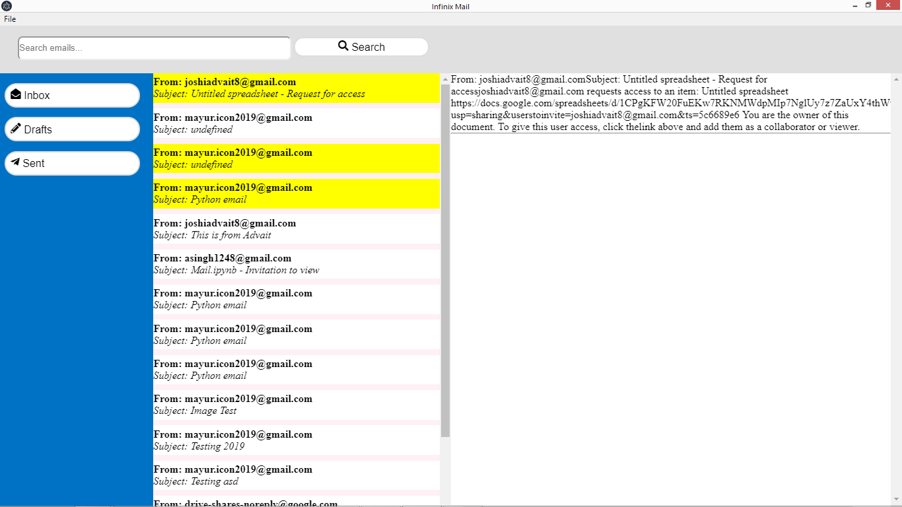
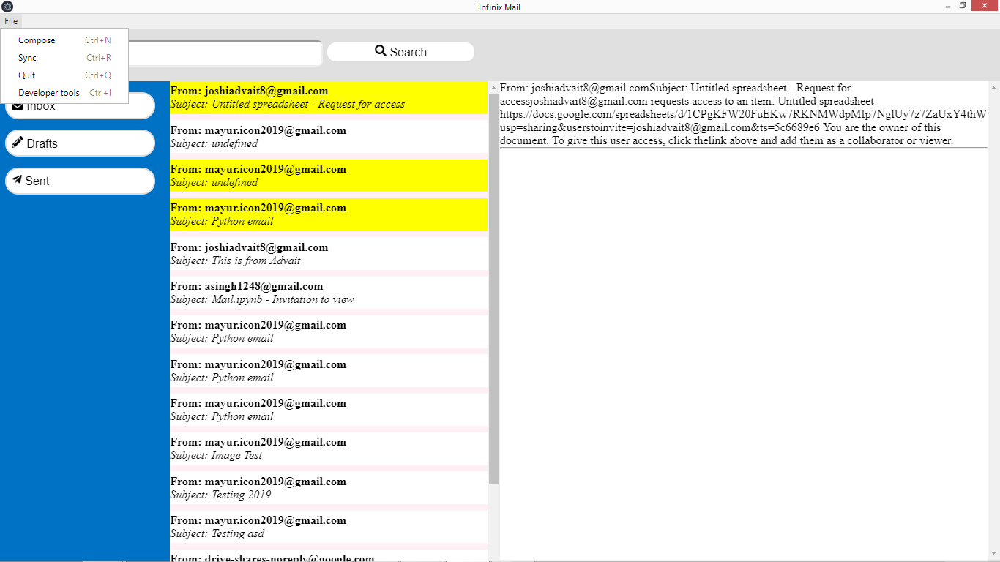
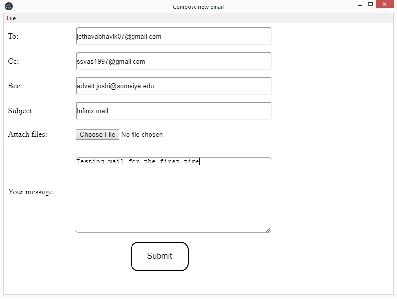
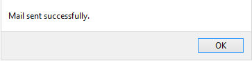

# Email-Client
### Opensource project as a part of Mumbai Hackathon 2019

Email client made using Electron JS for frontend and backend with node js for fetching of email from IMAP server and sending email using SMTP along with MIME data.

## Challenges
* Parsing of raw email to normal text
* Attachment sending with normal smtp using MIME types
* Fetching of attachments from raw emails

## Features
* Inbox Listing from IMAP server of all emails
* Compose Email
* Send email with cc,bcc and attachments
* Read Mails are marked "Yellow"

## Screenshots
* Inbox



* File Menu



* Compose Mail



* Sent Mail Confirmation




## Recognition

This project was done under ```24 hours``` in <a href ="https://github.com/MumbaiHackathon"> Mumbai Hackathon 2019</a> :smile:


## Contributors

<a href = "https://github.com/jethavabhavik07"> @Bhavik Jethava </a>

<a href = "https://github.com/ssvas1997"> @Srinivas Subramani </a>

<a href = "https://github.com/joshiadvait8"> @Advait Joshi </a>

<a href = "https://github.com/mayur124"> @Mayur Chawda </a>

<a href = "https://github.com/Asingh1248"> @Animesh Singh </a>

#####
with Open Source :heart:


